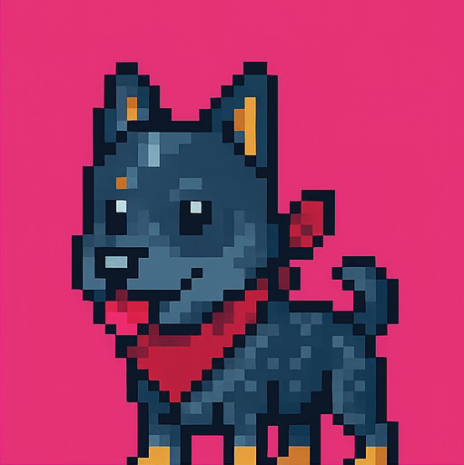

## Dynamic NFT vs Classic NFT (IPFS)

**BasicNft represents a classic IPFS-based NFT, while MoodNft is a dynamic on-chain SVG NFT.**

## Usage

### Install

```shell
$ make install
```

### Build

```shell
$ make build
```

### Test

```shell
$ make test
```

### Format

```shell
$ make fmt
```

### Gas Snapshots

```shell
$ forge snapshot
```

### Anvil

```shell
$ anvil
```

### Deploy
#### Deploy BasicNft to anvil

```shell
$ make deploy-anvil
```

#### Deploy BasicNft to sepolia
```shell
$ make deploy-sepolia
```

#### Deploy MoodNft to anvil
```shell
$ make deploy-mood-anvil
```

#### Deploy MoodNft to sepolia
```shell
$ make deploy-mood-sepolia
```

### Interaction
#### Mint BasicNft on anvil
```shell
$ make mint-nft-anvil
```

#### Mint BasicNft on sepolia
```shell
$ make mint-nft-sepolia
```

#### Mint MoodNft on anvil
```shell
$ make mint-mood-anvil
```

#### Mint MoodNft on sepolia
```shell
$ make mint-mood-sepolia
```

<div style="display: flex; gap: 20px; align-items: center;">



</div>
